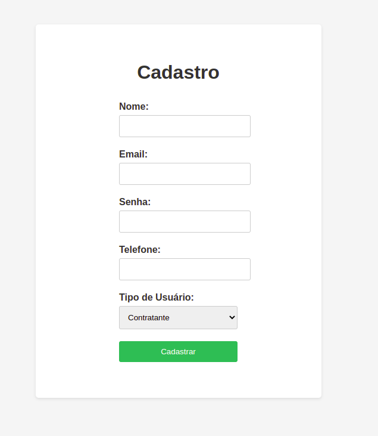
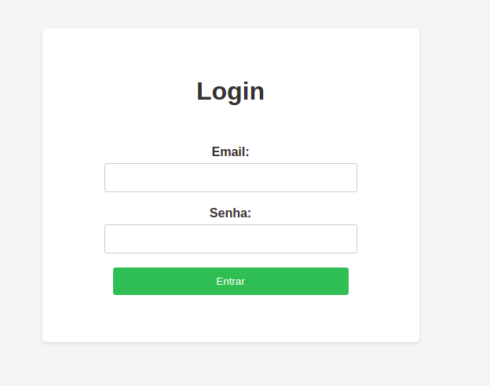
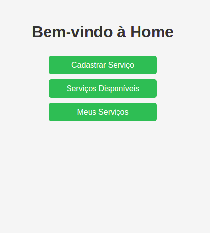
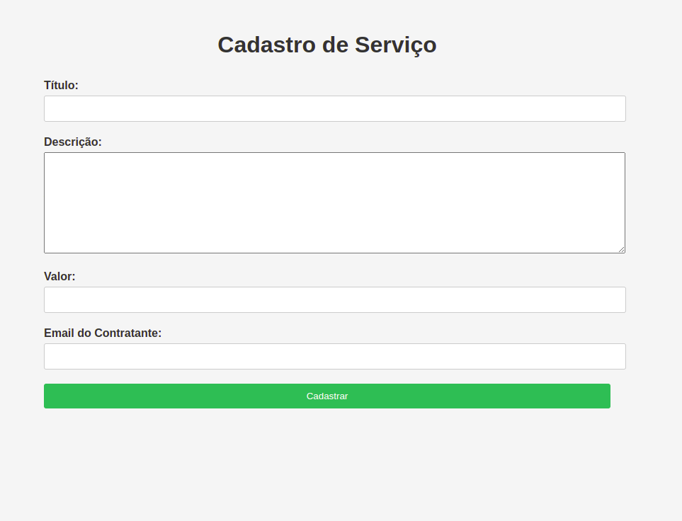
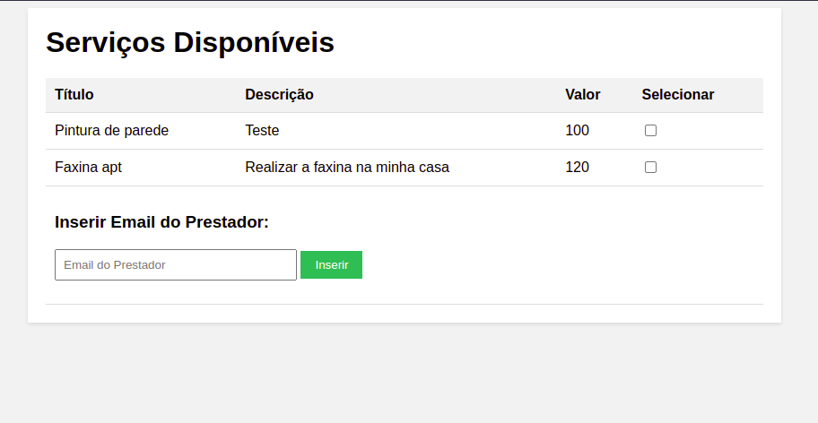
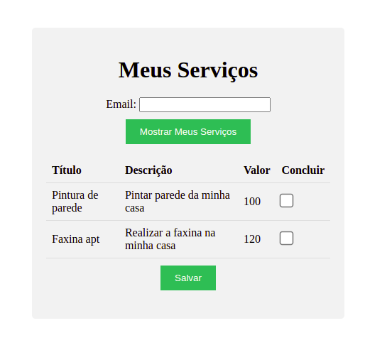

# APS - **Serviços que geram a Erradicação da Pobreza**

Esse projeto feito a partir da proposta da APS com a finalidade de propor uma solução que contribua para atingir os objetivos de desenvolvimento sustentável proposto pela ONU. A implementação em si tentamos deixar bem simples, e com conceitos de POO aplicados em conjunto com um banco de dados


## 📝 Requisitos

-   [Java 17](https://www.oracle.com/java/technologies/downloads/#java17)
-   [Maven 3.3+](https://maven.apache.org/download.cgi)

Recomendado:
-   [MySQL Workbench](https://www.mysql.com/products/workbench/)

## 💻 Como rodar localmente...

Como é um projeto Spring basta dar "run" na classe ```ApsApplication``` certificando-se que criou e apontou o banco no ```application.properties``` e mudando as variáveis para as suas, como senha e database. 
Os esquemas para criar as tabelas estão na pasta "sql"


## Diagrama de Classes


## 📷 Imagens do front-end do projeto





